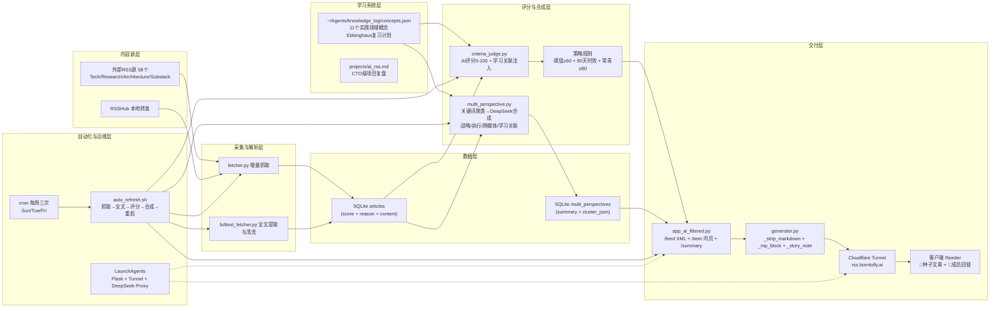

# 系统架构图（CTO 视角）

## 数据流说明

1. **采集**：fetcher.py 增量抓取58个源 → SQLite articles
2. **全文**：fulltext_fetcher.py 用UA伪装抓取全文（有墙则降级摘要）
3. **评分**：criteria_judge.py 加载知识图谱 → DeepSeek打分 + 学习关联写入reason
4. **聚类**：multi_perspective.py 关键词聚类（≤5篇/组）→ DeepSeek生成故事全貌
5. **交付**：Flask生成RSS XML → Cloudflare Tunnel → Reeder

## 关键设计决策

| 决策点 | 选择 | 替代方案 |
|---|---|---|
| 数据库 | SQLite（单文件，零配置） | PostgreSQL（多服务器写入时迁移） |
| 进程管理 | LaunchAgents（macOS原生） | Docker（需跨机器时迁移） |
| AI提供商 | DeepSeek（OpenAI兼容接口） | 改`base_url`即可切换GPT-4 |
| 内容投递 | Cloudflare Tunnel（无需公网IP） | 云服务器（需更高可用性时迁移） |
| 聚类算法 | 关键词重叠（快速无成本） | 向量嵌入（生产级精度） |
| 调度 | Cron 3次/周 | Celery+Redis（高频或实时需求） |

## 未来方向

- **整体简报（Holistic Brief）**：将criteria_reason + multi_perspective合成为单一AI生成简报，保留战略/执行/延伸思考结构
- **Ebbinghaus复习**：基于knowledge_log定期生成复习问题，会话开始时触发
- **更多Substack源**：One Useful Thing、Lenny's Newsletter
- **ai_diary / ai_health / ai_trade**：知识图谱扩展至其他项目实践领域
